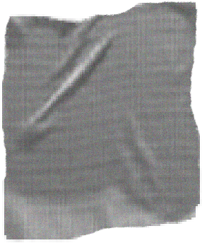

  

    <nav class="site-nav main-nav">
      <input type="checkbox" id="nav-trigger" class="nav-trigger" />
      <label for="nav-trigger">
        
          <svg viewBox="0 0 18 15" width="18px" height="15px">
            <path d="M18,1.484c0,0.82-0.665,1.484-1.484,1.484H1.484C0.665,2.969,0,2.304,0,1.484l0,0C0,0.665,0.665,0,1.484,0 h15.032C17.335,0,18,0.665,18,1.484L18,1.484z M18,7.516C18,8.335,17.335,9,16.516,9H1.484C0.665,9,0,8.335,0,7.516l0,0 c0-0.82,0.665-1.484,1.484-1.484h15.032C17.335,6.031,18,6.696,18,7.516L18,7.516z M18,13.516C18,14.335,17.335,15,16.516,15H1.484 C0.665,15,0,14.335,0,13.516l0,0c0-0.82,0.665-1.483,1.484-1.483h15.032C17.335,12.031,18,12.695,18,13.516L18,13.516z"/>
          </svg>
        
      </label>

      

          <a class="page-link" href="/manifesto">manifesto1</a>
      

      

          <a class="page-link" href="/programs">programs2</a>
      

      

          <a class="page-link" href="/curated-shelf">a curated shelf</a>
      

      

          <a class="page-link" href="/publishers">publishers</a>
      

      

          <a class="page-link" href="/submit">submit a work</a>
      

    </nav>
  

  

    

      

        
        
        
        
      

      

        Kwago3 is a Manila-based, independent book distributor committed to building intimate spaces4 for readers and storytellers to connect, create and collaborate.
      

    

  

  <ul>
    <li>
      1Written in Filipino, the manifesto expresses our core values and beliefs as an organization and is the
      foundation from which everything we do springs from. English translation is available.
    </li>
    <li>
      2<a href="http://warehouse-eight.com">Warehouse Eight</a> is our main co-conspirator in most of our programs and has helped us in a very major
      way in starting and growing our organization.
    </li>
    <li>
      3Kwago is mainly a distributor that has a book bar at the doorstep of Warehouse Eight, which serves
      fiction-inspired coffee and cocktails.
    </li>
    <li>
      4A space may be physical or virtual, a person, a community, a universe in a book or a shelf.
    </li>
  </ul>

